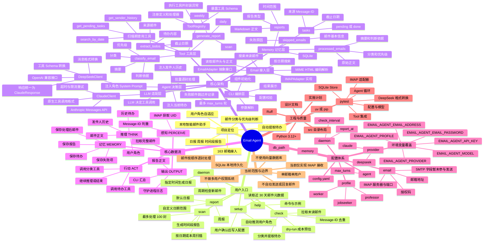
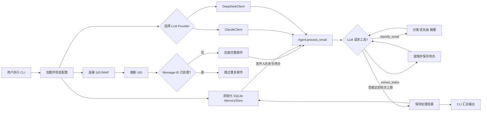
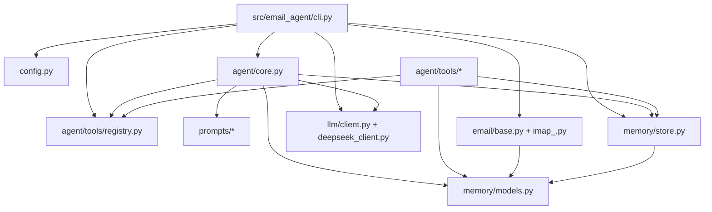

# Email Agent 项目思维导图

> 基于当前代码、README、设计文档与测试整理。主图适合快速建立全局认知，后面的流程图用于理解运行链路。

## 主运行链路

## 模块依赖关系

## 一句话理解

Email Agent 以 CLI 为入口，从 163 邮箱通过 IMAP 感知邮件，把邮件、用户角色和历史记忆交给 Claude 或 DeepSeek 推理，由模型选择“分类、提取待办、生成报告”等工具执行，最后将结果持久化到本地 SQLite，并通过命令行或守护进程持续输出。
